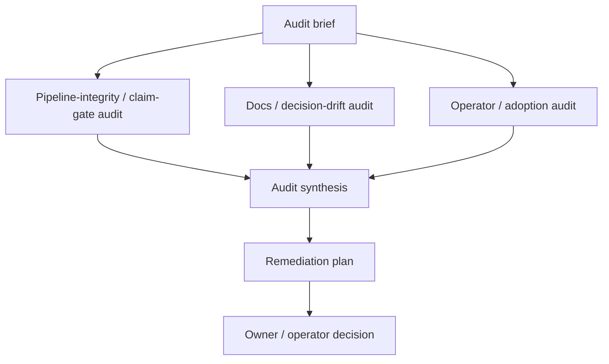

# RFC 0059: Three-Lane Code And Documentation Audit Workflow

Status: landed
Date: 2026-05-22
Context:
[`RFC 0007`](0007-architectural-revisit.md),
[`RFC 0025`](0025-cfd-calibration-claim-gates.md),
[`RFC 0027`](0027-resistance-calibration-acceptance.md),
[`RFC 0049`](0049-artifact-store-and-identity.md),
[`RFC 0054`](0054-calibration-campaign-tooling.md),
[`RFC 0058`](0058-stability-calibration-acceptance.md),
[`docs/SPEC.md`](../SPEC.md),
[`docs/DECISION_LOG.md`](../DECISION_LOG.md),
[`docs/ROADMAP.md`](../ROADMAP.md),
[`docs/USER_GUIDE.md`](../USER_GUIDE.md),
[`docs/ARCHITECTURE_MAP.md`](../ARCHITECTURE_MAP.md),
[`docs/UBIQUITOUS_LANGUAGE.md`](../UBIQUITOUS_LANGUAGE.md),
[`docs/RELEASE_DISCIPLINE.md`](../RELEASE_DISCIPLINE.md),
[`docs/CONTEXT_HYGIENE.md`](../CONTEXT_HYGIENE.md),
[`docs/workflows/0009-multi-lane-review`](../workflows/0009-multi-lane-review)

## Problem

kayak-gen has moved quickly across geometry, hydrostatics, analytical
resistance, real-OpenFOAM dispatch, mesh-evidence harnesses, the
Edinburgh DataShare extractor, the high-angle-GZ surfaces and
strain-gauged rig scaffold, the Generate panel + generative-search
jobs, the active-search NSGA-II / EHVI engines, the artifact store +
`runs` CLI, the calibration campaign sub-app, the design-report
exporter, and the stability acceptance + CFD-in-loop graduation
contract. That pace produces a specific maintenance hazard: source
behavior, RFC status headers, `DECISION_LOG.md` rows, `ROADMAP.md`
track entries, `USER_GUIDE.md` surface descriptions, example fixtures,
and operator-facing copy can drift from each other.

Single-lane repo reviews tend to collapse different questions into one
large pass:

- Does the code preserve the project's claim-state / accepted-use /
  readiness invariants (RFC 0025, RFC 0027, RFC 0058)?
- Do the docs in `docs/RELEASE_DISCIPLINE.md`'s public-behavior-change
  checklist actually agree with each other and with source?
- Can an operator drive the desktop GUI, the Trame web workspace, or
  the `kayakgen` CLI (20+ subcommands) without private project memory?
- Which RFCs are half-implemented, superseded by a successor, blocked
  on operator action (e.g. D006/D007/D014), or stale?

Those questions need different reading postures. A claim-gate reviewer
will notice different problems than a docs-drift reviewer or a
new-operator ergonomics reviewer. Running them as one generic review
encourages shallow coverage and makes the final report hard to act on.
`docs/workflows/0009-multi-lane-review` already showed the value of
three independent lanes converging on a findings ledger, but it was
scoped to the seven landed-on-`main` workflows of the 2026-05 push and
has no reusable shape.

kayak-gen needs a reusable workflow shape for a periodic code and docs
audit: three independent lanes with evidence-backed findings, followed
by synthesis and a prioritized remediation plan.

## Goals

- Define a first-class `code_doc_audit` workflow shape that can be
  represented in docs, examples, and eventually a workflow generator.
- Split audit work into three parallel lanes: pipeline-integrity /
  claim-gate, docs / decision drift, and operator / adoption.
- Require concrete evidence for every finding: file paths, source
  behavior, tests, command output, docs claims, RFC status headers,
  or `DECISION_LOG.md` rows.
- Produce a synthesis that deduplicates overlap and assigns every
  material finding to a follow-up path.
- Make superseded, obsolete, blocked, and half-implemented RFCs
  explicit rather than leaving them as oral history. The RFC index
  already encodes some of this (e.g. RFC 0017 "proposed background;
  successor 0041"); the audit should keep that index honest.
- Preserve historical fixtures (`tests/golden/`, the Edinburgh
  acquisition packet, opt-in `interFoam` runs, archived sweep records)
  as provenance. The audit should flag stale current claims without
  rewriting history.
- Keep the output actionable for a human principal or AI operator:
  severity, owner surface, recommended next action, and whether the
  item belongs in `docs/TODO.md` / `docs/BACKLOG_EXECUTION_PLAN.md`,
  a new RFC, an existing RFC, a `DECISION_LOG.md` row, a docs-only
  fix, or a wontfix note.

## Non-Goals

- Fixing all findings inside the audit workflow. The audit produces a
  remediation plan; implementation is separate unless a finding is
  trivial and explicitly assigned.
- Replacing focused code review for a specific patch or RFC slice.
- Replacing `pytest` / golden tests / mesh-evidence harnesses / the
  envelope-blocked calibration gates.
- Treating historical fixtures (`tests/golden/`, archived sweep
  records, the Edinburgh acquisition packet, opt-in real-OpenFOAM
  artifacts) as current docs.
- Rewriting accepted decisions without a new `DECISION_LOG.md` row.
- Adding broad transcript capture or terminal-output inspection as
  audit evidence.
- Making all three lanes use different model providers. Lane diversity
  is recommended (the 0009 workflow used codex / claude / gemini), but
  the workflow shape is provider-neutral.
- Producing physical fixture data, lab campaigns, or other
  operator-only artifacts (D006 / D007 / D014). The audit flags the
  blockers; it does not resolve them.

## Proposal

### 1. Workflow graph

The workflow has three parallel audit lanes and one convergence path:



The three audit lanes run independently. They should not read each
other's draft findings before publishing, unless the workflow
explicitly adds a second pass. The synthesis job is responsible for
merging duplicates and resolving conflicting classifications. This
shape generalizes `docs/workflows/0009-multi-lane-review`: same
three-lanes-into-a-ledger topology, parameterized scope, and a
remediation plan as a first-class output rather than a final-review
verdict.

### 2. Audit lanes

#### Pipeline-integrity / claim-gate auditor

Primary question: does current source behavior preserve kayak-gen's
claim-state, accepted-use, readiness, and acceptance-gate invariants?

Coverage:

- `claim_state` literals (`raw_unvalidated`, `validated`, etc.) — no
  surface promotes a result past its evidence; RFC 0025 / RFC 0027 /
  RFC 0058 acceptance contracts hold;
- `result_semantics` labels on resistance and `GZ` outputs (RFC 0043
  `unvalidated_hydrostatic_comparison` → `validated_hydrostatic_comparison`
  only via an accepted `StabilityFitRecord`);
- opt-in CFD / mesh / GZ gates: env knobs (RFC 0041 / RFC 0046
  three-mechanism opt-in), `--bind-evidence` chains (RFC 0045), and
  the `cfd_in_loop_evaluator_status` contract (RFC 0058);
- accepted-fit records and reviewer signatures (RFC 0027 / RFC 0054 /
  RFC 0058);
- `MeasuredStabilityFixture` / `StabilityFixturePromotionPacket`
  validators (RFC 0056) and the analytical-claim upgrade contract;
- artifact-store identity: `Hull.record_hash` / `design_hash`,
  `FilesystemArtifactStore`, `SqliteIndex` (RFC 0049);
- public Pydantic schemas — `schema_version`, field name / type /
  default — and the metric registry (Phase 5);
- evaluator subprocess isolation, generative-search job records, and
  log redaction (RFC 0057);
- tests that pin a claim-gate boundary
  (`tests/test_vocabulary_coverage.py`, golden tests, the mesh
  evidence + `--bind-evidence` chain);
- examples / fixtures that might teach retired behavior.

This lane should prefer source, generated schemas, tests, and current
evaluator metadata over prose.

#### Docs / decision-drift auditor

Primary question: do the docs in `docs/RELEASE_DISCIPLINE.md`'s
public-behavior-change checklist describe current source behavior and
current decision state honestly?

Coverage:

- `docs/SPEC.md` as product-boundary source of truth;
- `docs/PRD.md` scope and status assertions;
- `docs/DECISION_LOG.md` accepted, superseded, and obsoleted rows
  (including D006 / D007 / D014 / D018 / D023 / D025 / D027);
- `docs/ROADMAP.md` track rows and Future-Striatum-Batches disposition;
- `docs/rfcs/README.md` status headers — RFCs marked
  "proposed background; successor NNNN", "partial landed …", or
  "landed …" must match source and tests;
- `CHANGELOG.md` `Added` / `Changed` / `Fixed` entries against actual
  landings;
- `docs/ARCHITECTURE_MAP.md` package layout, CLI list, and
  durable-artifact table;
- `docs/UBIQUITOUS_LANGUAGE.md` plus
  `tests/test_vocabulary_coverage.py` drift;
- `docs/USER_GUIDE.md` surface descriptions vs. actual CLI / GUI /
  web behavior;
- `docs/WEB_VERIFICATION.md` claims against the Trame workspace;
- `OPERATOR_REPORT.md` checkpoints for externally-relevant changes
  (network access, real-solver run, external acquisition);
- half-implemented RFCs that need a Phase status, an explicit
  successor, an obsoletion note, or a follow-up RFC;
- conflicts between docs and source behavior.

This lane should not "clean up" historical fixtures. It should
distinguish frozen provenance (`tests/golden/`, archived sweep
records, the Edinburgh acquisition packet) from current product
documentation.

#### Operator / adoption auditor

Primary question: can an operator or first adopter use kayak-gen
without private project memory?

Coverage:

- day-zero setup (`pyproject.toml` extras, optional `[builder]` /
  `[report]` dependencies, opt-in CFD env knobs);
- `kayakgen` CLI subcommand discoverability and `--help` clarity
  across all 20+ subcommands (search, runs, stability, calibration,
  build-export, design-report, target-draft, target-trim, sensitivity,
  mesh-evidence, mesh-package, sweep, etc.);
- desktop GUI flows (`gui.py`, `pyvista_view.py`);
- Trame web workspace and Generate panel: form-builder, 2D Pareto
  scatter, auto-poll, fork-with-seed, log redaction, CFD-in-loop
  acknowledgement copy, accepted-fit-aware frontier colouring;
- export menu / disabled-copy correctness (RFC 0038, RFC 0037,
  RFC 0035);
- error messages, recovery paths, and first-run smoke;
- overly complex areas that need a simpler adapter or guide;
- places where file-based artifacts are useful but should not become
  the control plane;
- UI / API gaps that block design exploration, evaluator selection,
  job observation, or recovery.

This lane is allowed to raise product-shape findings, not just doc
bugs. It should still provide evidence and a concrete recommendation.

### 3. Finding record

Each lane should publish a `FINDINGS.md` artifact with stable finding
ids. V1 uses plain Markdown sections; it does not introduce a new
Pydantic schema.

Recommended entry shape:

```text
### AUD-001: Short title

severity: critical | high | medium | low | info
category: claim_gate | docs_drift | implementation_gap | operator_ergonomics | test_gap | rfc_status
status: open
claim: One sentence describing the problem.
evidence:
- path/to/file.ext:line - concise evidence
- command or test result, when relevant
impact: Why this matters (cite the claim-state / accepted-use / readiness
  invariant or the docs-checklist row affected, if any).
recommended_action: What should happen next.
follow_up: existing TODO/RFC/decision | new RFC | DECISION_LOG row |
  docs fix | test coverage | wontfix
```

Findings without concrete evidence should be downgraded to
observations or open questions. High and critical findings require at
least one source or docs reference and an explicit recommended action.

### 4. Synthesis and remediation plan

The synthesis job produces two artifacts:

- `SYNTHESIS.md`: grouped findings, duplicate-merge table, conflicts
  between lanes, and the recommended priority order.
- `REMEDIATION_PLAN.md`: a task-oriented plan that maps each material
  finding to an owner surface.

The remediation plan should classify every high or critical finding
as one of:

- already covered by an existing `docs/TODO.md` entry,
  `docs/BACKLOG_EXECUTION_PLAN.md` row, or open RFC;
- needs a new RFC;
- needs a `DECISION_LOG.md` row (new accepted decision or supersession
  note);
- needs a docs-only correction (any of the
  `RELEASE_DISCIPLINE.md` public-behavior-change checklist files);
- needs source / test work;
- historical only, no action;
- accepted risk or wontfix, requiring an owner decision (typical for
  blockers gated on D006 / D007 / D014 operator action).

### 5. Artifact layout

Recommended layout for a run:

```text
docs/audits/<YYYY-MM-DD>-code-doc-audit/
  pipeline-integrity/FINDINGS.md
  docs-decision-drift/FINDINGS.md
  operator-adoption/FINDINGS.md
  SYNTHESIS.md
  REMEDIATION_PLAN.md
  DECISION.md
```

`docs/audits/` is a new top-level docs subdirectory; it is created on
first run. `DECISION.md` is optional until the human principal accepts
a remediation direction. When present it should follow the
`DECISION_LOG.md` row format and cite the audit run id.

### 6. Scope presets

The same workflow shape should support several scopes:

| Preset | Use when | Typical input |
|---|---|---|
| `full_repo` | Periodic broad audit. | Repo root plus current `ROADMAP.md`. |
| `rfc_cluster` | A group of related RFCs may have drifted. | RFC ids, docs, tests, and implementation paths. |
| `release_candidate` | A `CHANGELOG.md` entry is about to ship. | Changelog, tag diff, tests, release docs. |
| `subsystem` | One bounded area needs pressure. | Paths such as `kayakgen/eval/stability/`, `kayakgen/ui/web/`, or `kayakgen/cli/`. |
| `adoption_path` | First-user experience needs validation. | `README.md`, `docs/USER_GUIDE.md`, install / first-run docs. |

V1 represents the preset in the audit brief. A future workflow
generator can turn it into validated workflow options.

### 7. Workflow integration

V1 ships:

- a runnable workflow under `docs/workflows/NNNN-code-doc-audit/`
  parallel to `0009-multi-lane-review`, with `workflow.json`,
  `RUNBOOK.md`, `SOURCES.md` (filled in per run), `prompts/`, and
  `roles/`;
- a default lane assignment of three fresh sessions across available
  providers (`claude`, `codex`, `gemini`), matching the precedent in
  `0009-multi-lane-review`;
- a default adversary framing per lane: claim-gate drift,
  docs-checklist drift, operator-ergonomics drift.

The workflow must validate with
`striatum workflow validate` as required by
`docs/workflows/0009-multi-lane-review/RUNBOOK.md`.

## Acceptance Criteria

- A runnable example workflow exists at
  `docs/workflows/NNNN-code-doc-audit/` and validates with
  `striatum workflow validate`.
- `docs/rfcs/README.md` lists this RFC with the correct status header.
- `docs/USER_GUIDE.md` gains a short section explaining when to run
  the audit shape and where the artifacts land.
- The workflow produces three independent `FINDINGS.md` artifacts plus
  `SYNTHESIS.md` and `REMEDIATION_PLAN.md` under
  `docs/audits/<YYYY-MM-DD>-code-doc-audit/`.
- Findings include stable ids, severity, category, evidence, impact,
  and recommended action.
- The synthesis maps every high or critical finding to a follow-up
  path from the list in §4.
- Historical fixtures (`tests/golden/`, archived sweep records, the
  Edinburgh acquisition packet, opt-in real-OpenFOAM artifacts) are
  preserved as historical unless a current doc claims their behavior
  is still live.
- At least one dogfood run of this shape lands before the RFC is
  marked `landed`; its remediation plan is referenced from
  `CHANGELOG.md`.

## Open Questions

- Should audit findings get a dedicated Pydantic schema under
  `kayakgen/eval/audit/` (parallel to `accepted_fit.py`), or is plain
  Markdown enough for V1?
- Should the workflow require model-family diversity across lanes, or
  only fresh sessions with declared review postures?
- Should `REMEDIATION_PLAN.md` be a new artifact kind, or live as a
  normal synthesis / handoff artifact?
- Should the audit auto-open a `DECISION.md` stub for any
  high-severity finding that recommends a `DECISION_LOG.md` row, or
  leave that to the operator?
- Should `docs/audits/<date>/` directories live forever in-tree, or
  should they roll into `docs/research/` after a retention window?
- Should the Generate panel surface a "last audit" link the way it
  surfaces accepted-fit envelope status?

## Implementation Path

- Step 1 — Land this RFC as `proposed` and add its row to
  `docs/rfcs/README.md`.
- Step 2 — Scaffold `docs/workflows/NNNN-code-doc-audit/` with
  `workflow.json`, `RUNBOOK.md`, `SOURCES.md` template, per-lane
  prompts under `prompts/`, and per-lane role files under `roles/`,
  mirroring `0009-multi-lane-review`. Validate with
  `striatum workflow validate`.
- Step 3 — Add a short `docs/USER_GUIDE.md` section pointing at the
  workflow and the `docs/audits/<date>/` artifact layout.
- Step 4 — Dogfood: run a `full_repo` audit, write findings under
  `docs/audits/<YYYY-MM-DD>-code-doc-audit/`, publish
  `SYNTHESIS.md` + `REMEDIATION_PLAN.md`, and feed each high /
  critical finding into the appropriate follow-up path
  (`docs/TODO.md`, a new RFC, a `DECISION_LOG.md` row, or a docs
  fix). Reference the run from `CHANGELOG.md`.
- Step 5 — Promote this RFC to `landed` once Step 4 is complete; add
  a `DECISION_LOG.md` row recording the new audit cadence (e.g.
  per-release-candidate plus quarterly `full_repo`).

## Domain Modeling

This RFC adds a workflow shape and a documentation surface, not a new
domain aggregate or claim-state.

The audit lanes produce artifacts. The synthesis job turns artifacts
into a remediation plan. The human principal may later accept,
reject, split, or defer the plan through a `DECISION_LOG.md` row or
follow-up RFCs.

In `docs/DDD.md` terms, `code_doc_audit` is a process / value-object
catalog entry that orchestrates existing aggregates (RFCs, decision
rows, accepted-fit records, artifact-store entries). An individual
finding remains an artifact-backed claim until accepted into a
`DECISION_LOG.md` row, a `docs/TODO.md` entry, an RFC, an issue, or a
source change. No new term is added to
`docs/UBIQUITOUS_LANGUAGE.md` by this RFC alone; the dogfood run in
Step 4 may surface candidates (e.g. `audit lane`, `audit finding`)
that the follow-up landing would add via the standard glossary path.
