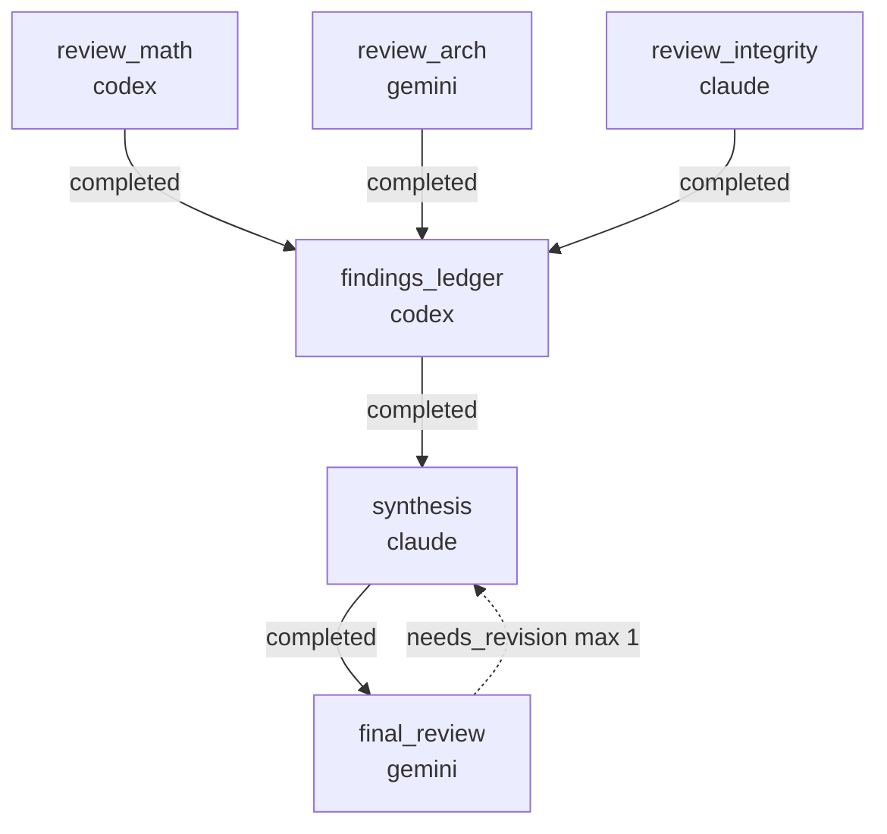

# RUNBOOK — 0009 multi-lane review

## What this workflow does

Reviews the seven workflows landed on `main` (RFCs 0004 + 0005 + 0006
+ 0007 + 0008 + 0002/0003 audit) using three independent lanes
in parallel, then converges through a findings ledger, a remediation
synthesis, and a final-review gate.



## Prerequisites

- `striatum --version` >= 2.7.0.
- `claude`, `codex`, and `gemini` available on `PATH`.
- `striatum doctor` reports `ok: true`.

## Run

```bash
TARGET=/home/halbritt/git/kayak-gen
WF=$TARGET/docs/workflows/0009-multi-lane-review/workflow.json

striatum --repo "$TARGET" workflow validate "$WF" --json
striatum --repo "$TARGET" workflow plan     "$WF" --json
striatum --repo "$TARGET" run prepare       --workflow "$WF" --json
# copy the run_id from the response
striatum --repo "$TARGET" run start --run-id <run_id> --json
striatum --repo "$TARGET" dashboard --run-id <run_id> --once
```

The runner creates `striatum/0009-multi-lane-review/` on the run's
branch. Each reviewer writes a single Markdown finding to its lane's
subdirectory. The ledger / synthesis / final review write under their
own subdirectories.

## Outputs

```
striatum/0009-multi-lane-review/
├── codex/REVIEW_MATH.md
├── gemini/REVIEW_ARCH.md
├── claude/REVIEW_INTEGRITY.md
├── ledger/FINDINGS.md
├── synthesis/REMEDIATION.md
└── final/FINAL_REVIEW.md
```

A `final_review` verdict of `accepted` ends the run. `needs_revision`
cycles back into `synthesis` once (max iterations = 1). After that the
operator decides.
