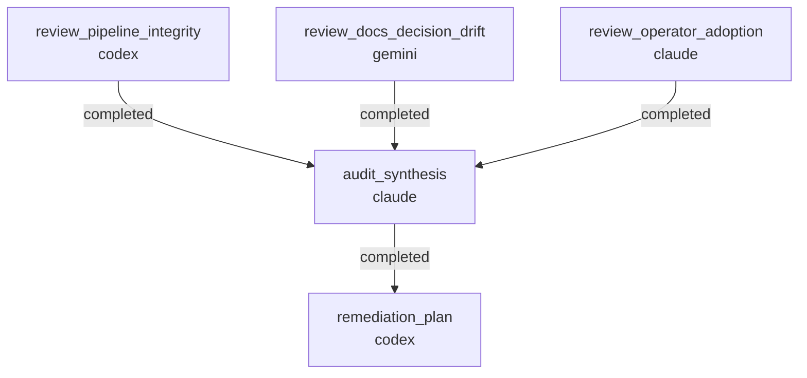

# RUNBOOK — 0029 three-lane code+doc audit

Source RFC: [`docs/rfcs/0059-three-lane-code-and-doc-audit-workflow.md`](../../rfcs/0059-three-lane-code-and-doc-audit-workflow.md)

## What this workflow does

Implements the `code_doc_audit` workflow shape from RFC 0059. Three
independent audit lanes run in parallel (pipeline-integrity,
docs-decision-drift, operator-adoption), then converge through a synthesis
job into a remediation plan.



The three audit lanes do NOT read each other's draft findings; the
synthesis job is the only place duplicates get merged.

## Prerequisites

- `striatum --version` >= 2.7.0.
- `claude`, `codex`, and `gemini` available on `PATH` (lane diversity is
  recommended; see RFC 0059 Open Questions).
- `striatum doctor` reports `ok: true`.
- `docs/audits/` exists or will be created by the synthesis job's write
  scope.

## Choosing a scope preset

RFC 0059 §6 defines five presets:

| Preset | Use when |
|---|---|
| `full_repo` | Periodic broad audit (default). |
| `rfc_cluster` | A group of related RFCs may have drifted. |
| `release_candidate` | A CHANGELOG entry is about to ship. |
| `subsystem` | One bounded area needs pressure. |
| `adoption_path` | First-user experience needs validation. |

The preset is declared in `SOURCES.md` for the run, and the per-lane
prompts read it from there.

## Run

```bash
TARGET=/home/halbritt/git/kayak-gen
WF=$TARGET/docs/workflows/0029-code-doc-audit/workflow.json

# Fill in SOURCES.md for this run before validating.
${EDITOR:-vi} $TARGET/docs/workflows/0029-code-doc-audit/SOURCES.md

striatum --repo "$TARGET" workflow validate "$WF" --json
striatum --repo "$TARGET" workflow plan     "$WF" --json
striatum --repo "$TARGET" run prepare       --workflow "$WF" --json
# copy the run_id from the response
striatum --repo "$TARGET" run start --run-id <run_id> --json
striatum --repo "$TARGET" dashboard --run-id <run_id> --once
```

The runner creates
`docs/audits/<YYYY-MM-DD>-code-doc-audit/` on the run's branch. Each
reviewer writes one `FINDINGS.md` to its lane subdirectory; the synthesis
and remediation-plan jobs write `SYNTHESIS.md` + `REMEDIATION_PLAN.md` at
the audit-run root.

## After the run

1. Review `REMEDIATION_PLAN.md`. Decide which batches to drive in-place
   (docs-only) vs spin off as follow-up striatum workflows (source/test).
2. Land any docs batch in the same change set as the audit artifacts so
   `CHANGELOG.md` records the audit run and the immediate remediation in
   one entry.
3. For each batch handed off to a follow-up workflow, open a TODO entry
   referencing the finding IDs (`AUD-P-001` etc.). The audit's
   FINDINGS.md `status:` fields remain `open` until the follow-up workflow
   closes them per `REMEDIATION_PLAN.md` §"Status closure rule".

## Cadence (suggested)

- `full_repo` quarterly.
- `release_candidate` before any CHANGELOG entry that touches a public
  CLI or schema.
- `rfc_cluster` whenever three or more related RFCs land within a 30-day
  window.

## Dogfood history

- 2026-05-22 — first run, `full_repo` preset, single-agent execution
  (lane-diversity caveat documented in SYNTHESIS.md). Findings:
  `docs/audits/2026-05-22-code-doc-audit/`. Drove R1 batch in-place.
