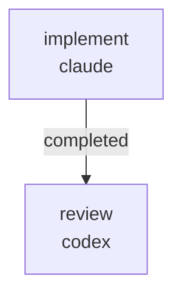

# RUNBOOK — 0030 stability claim-gate Literal widening (AUD-P-001 + AUD-P-002)

Source audit:
[`docs/audits/2026-05-22-code-doc-audit/REMEDIATION_PLAN.md`](../../audits/2026-05-22-code-doc-audit/REMEDIATION_PLAN.md)
batches R3 and R7. Source findings:
[`docs/audits/2026-05-22-code-doc-audit/pipeline-integrity/FINDINGS.md`](../../audits/2026-05-22-code-doc-audit/pipeline-integrity/FINDINGS.md)
finding IDs `AUD-P-001` (high) and `AUD-P-002` (low).

## What this workflow does

Closes the two stability claim-gate findings the 2026-05-22 code+doc
audit deferred to a follow-up workflow:

- **R3 / AUD-P-001 (high)** — widen
  `kayakgen/eval/contract.py:175` `GZCurve.result_semantics` from a
  one-element Literal to the two-element Literal RFC 0058 actually
  defines as `AnalyticalClaimLabel`. Add a serialization round-trip test
  that exercises the validated label through
  `EvaluationResult.model_validate_json(result.model_dump_json())` so
  the regression is pinned before stage 4 lands a non-empty fit registry.
- **R7 / AUD-P-002 (low)** — introduce a shared
  `EMPTY_STABILITY_FIT_REGISTRY` constant in
  `kayakgen/eval/stability/accepted_fit.py` and consume it at the three
  hardcoded `fit_registry=()` / `registry=()` call sites so the
  stage-4 graduation point is named in one place.



The workflow is intentionally minimal: a single implementer lane writes
the patch + test, then a single reviewer lane verifies it. No
synthesis, no remediation cycle — the change is small enough to land
in one pass.

## Prerequisites

- `~/git/striatum/.venv/bin/striatum --version` >= 1.57.0.
- `claude` and `codex` available on `PATH`.
- `striatum doctor` reports `ok: true`.
- Repo virtualenv: `.venv/bin/pytest` works.

## Run

```bash
TARGET=/home/halbritt/git/kayak-gen
WF=$TARGET/docs/workflows/0030-stability-claim-gate-literal/workflow.json

~/git/striatum/.venv/bin/striatum --repo "$TARGET" workflow validate "$WF" --json
~/git/striatum/.venv/bin/striatum --repo "$TARGET" workflow plan     "$WF" --json
~/git/striatum/.venv/bin/striatum --repo "$TARGET" run prepare       --workflow "$WF" --json
# copy the run_id from the response
~/git/striatum/.venv/bin/striatum --repo "$TARGET" run start --run-id <run_id> --json
~/git/striatum/.venv/bin/striatum --repo "$TARGET" dashboard --run-id <run_id> --once
```

## Verification

The implementer must run the following test set in the repo venv and
attach the output to `PATCH_SUMMARY.md`:

```bash
.venv/bin/pytest \
  tests/test_gzcurve_result_semantics_round_trip.py \
  tests/test_stability.py \
  tests/test_high_angle_stability_evaluator.py \
  tests/test_resolve_analytical_claim_label.py \
  tests/test_stability_accepted_fit.py \
  tests/test_vocabulary_coverage.py \
  tests/test_generate_frontier_view.py \
  -q
```

All tests must pass. The new file
`tests/test_gzcurve_result_semantics_round_trip.py` carries three
assertions (subclass constructs with the validated label; round-trip
through `EvaluationResult.model_validate_json(...)` is identity; the
parent `GZCurve` rejects an unknown label).

## Out of scope (parent agent owns)

- `CHANGELOG.md` — the parent workflow records the `### Fixed` entry
  citing `AUD-P-001` and `AUD-P-002`.
- `docs/audits/2026-05-22-code-doc-audit/pipeline-integrity/FINDINGS.md`
  `status:` fields — the parent flips both from `open` to `closed`
  after this workflow lands.
- Any other audit FINDINGS.md or REMEDIATION_PLAN.md edits.

## After the run

1. Operator reviews `PATCH_SUMMARY.md` + `REVIEW.md` under
   `docs/audits/2026-05-22-code-doc-audit/follow-ups/0030/`.
2. Operator (or parent workflow) records the `CHANGELOG.md ### Fixed`
   entry citing `AUD-P-001` and `AUD-P-002`, flips the two finding
   statuses to `closed`, and merges the branch.
