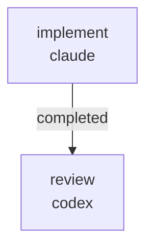

# RUNBOOK — 0031 vocabulary coverage for RFC 0057/0058 (R2-test-slice + R8)

Source plan: [`docs/audits/2026-05-22-code-doc-audit/REMEDIATION_PLAN.md`](../../audits/2026-05-22-code-doc-audit/REMEDIATION_PLAN.md) batches **R2 (test slice)** and **R8**.

## What this workflow does

Closes the two test-shaped findings from the 2026-05-22 audit that the
docs slice of R2 deliberately left open:

- **AUD-P-003**: extends `tests/test_vocabulary_coverage.py` so the six
  RFC 0057/0058 aggregate-root terms (`GenerativeJob`,
  `StabilityFitRecord`, `StabilityFixturePromotionPacket`,
  `MeasuredStabilityFixture`, `cfd_in_loop_evaluator_status`,
  `AnalyticalClaimLabel`) are pinned against `docs/UBIQUITOUS_LANGUAGE.md`.
- **AUD-P-004**: adds a regression test that pins the documented
  `kayakgen runs jobs --state queued|running|succeeded|failed|cancelled|resumable`
  vocabulary against the source `JobState` Literal in
  `kayakgen/services/generative_jobs.py`.



Two sequential jobs. The implement job edits only
`tests/test_vocabulary_coverage.py` and the run's artifact directory.
The review job is read-only and writes one `REVIEW.md`.

## Prerequisites

- `striatum --version` >= 2.7.0.
- `claude` and `codex` available on `PATH`.
- `striatum doctor` reports `ok: true`.
- The R1 docs batch of the 2026-05-22 audit has landed — the six
  glossary terms must already be in `docs/UBIQUITOUS_LANGUAGE.md`.
  Verify with `grep -c "GenerativeJob\\|StabilityFitRecord" docs/UBIQUITOUS_LANGUAGE.md`.

## Run

```bash
TARGET=/home/halbritt/git/kayak-gen
WF=$TARGET/docs/workflows/0031-vocab-coverage-rfc-0057-0058/workflow.json

striatum --repo "$TARGET" workflow validate "$WF" --json
striatum --repo "$TARGET" workflow plan     "$WF" --json
striatum --repo "$TARGET" run prepare       --workflow "$WF" --json
# copy the run_id from the response
striatum --repo "$TARGET" run start --run-id <run_id> --json
striatum --repo "$TARGET" dashboard --run-id <run_id> --once
```

The runner creates
`docs/audits/2026-05-22-code-doc-audit/follow-ups/0031/` on the run's
branch. The implement job writes `PATCH_SUMMARY.md` there; the review
job writes `review/REVIEW.md` underneath.

## Gating tests

```bash
.venv/bin/pytest tests/test_vocabulary_coverage.py -v
```

All cases must pass. If a glossary term is missing, stop and report —
do not edit `docs/UBIQUITOUS_LANGUAGE.md` from inside this workflow
(that surface is owned by the parent audit's R1 batch).

## After the run

1. Parent agent flips `AUD-P-003` and `AUD-P-004` from `open` to
   `closed` in
   `docs/audits/2026-05-22-code-doc-audit/pipeline-integrity/FINDINGS.md`.
2. Parent agent adds a `CHANGELOG.md ### Fixed` line citing the two
   finding IDs.
3. Parent agent flips R2 (test slice) + R8 status in
   `REMEDIATION_PLAN.md` if it tracks closure status per batch.

## What this workflow must NOT touch

- `docs/UBIQUITOUS_LANGUAGE.md` — already updated by the R1 batch.
- `docs/USER_GUIDE.md` — owned by the parent audit's R1 batch / future
  docs slices; this workflow only reads it.
- `CHANGELOG.md` — parent agent updates.
- `docs/audits/2026-05-22-code-doc-audit/pipeline-integrity/FINDINGS.md`
  — parent agent flips statuses.
- `kayakgen/cli/runs_cli.py`, `kayakgen/cli/main.py`,
  `kayakgen/eval/contract.py`, `kayakgen/eval/stability/` — owned by
  parallel workflows.
