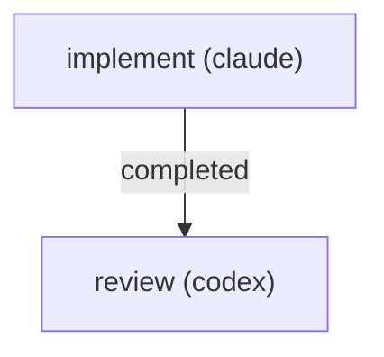

# RUNBOOK — 0032 CLI ergonomics: runs headers/filters + CFD CLI polish

Source audit: [`docs/audits/2026-05-22-code-doc-audit/REMEDIATION_PLAN.md`](../../audits/2026-05-22-code-doc-audit/REMEDIATION_PLAN.md) batches **R4** and **R5**.

## What this workflow does

Closes three medium / medium-low operator-adoption findings from the
2026-05-22 code+doc audit:

- **AUD-O-004** (R4) — `kayakgen runs list` and `kayakgen runs jobs` emit
  tab-separated rows with no header row, and the `--filter key:value` help
  on `runs query` / `runs jobs` does not enumerate the keys the
  implementation actually honors.
- **AUD-O-005** (R5) — the `mesh-evidence` env-var refusal points operators
  at `KAYAKGEN_OPENFOAM_LOCAL_RUN=1` without naming RFC 0046's other two
  opt-in mechanisms (profile flag / persistent setting) or saying that
  `mesh-evidence` currently honors only the env knob.
- **AUD-O-006** (R6) — the `cfd prepare` success path echoes
  `wrote <dir>` / `status: pending` without naming the next step
  (`kayakgen cfd run <dir>`) or the opt-ins that may need to be set first.

Two sequential jobs:



The implement job writes the source / docs / patch summary; the review
job reads the patch and publishes one finding artifact with verdict
`accept`, `accept_with_findings`, `needs_revision`, or `reject`.

## Prerequisites

- `striatum --version` >= 2.7.0.
- `striatum doctor` reports `ok: true`.
- A working `.venv/` in the repo root (the implementer runs
  `.venv/bin/pytest`).
- The `claude` and `codex` lane wrappers under `.striatum/bin/` (created
  by `striatum init`).

## Run

```bash
TARGET=/home/halbritt/git/kayak-gen
WF=$TARGET/docs/workflows/0032-cli-ergonomics-runs-cfd/workflow.json

striatum --repo "$TARGET" workflow validate "$WF" --json
striatum --repo "$TARGET" workflow plan     "$WF" --json
striatum --repo "$TARGET" run prepare       --workflow "$WF" --json
striatum --repo "$TARGET" run start --run-id <run_id> --json
striatum --repo "$TARGET" dashboard --run-id <run_id> --once
```

Artifacts land under
`docs/audits/2026-05-22-code-doc-audit/follow-ups/0032/`:

```
PATCH_SUMMARY.md
reviews/REVIEW.md
```

## After the run

1. Confirm the review verdict is `accept` or `accept_with_findings`.
2. Update `CHANGELOG.md` (`### Fixed` entry citing AUD-O-004 /
   AUD-O-005 / AUD-O-006) — parent agent / operator action, not the
   workflow's responsibility.
3. Flip the three findings' `status:` from `open` to `closed` in
   `docs/audits/2026-05-22-code-doc-audit/operator-adoption/FINDINGS.md`
   per the closure rule in `REMEDIATION_PLAN.md`.

## Scope guardrails

The implementer must NOT touch:

- `CHANGELOG.md` (parent agent updates it).
- Any `FINDINGS.md` (parent agent flips statuses).
- `kayakgen/eval/contract.py`, `kayakgen/eval/stability/`,
  `tests/test_vocabulary_coverage.py`, `kayakgen/ui/web/` — owned by
  parallel follow-up workflows (0030 / 0031).
- Anything outside `kayakgen/cli/runs_cli.py`, `kayakgen/cli/main.py`,
  `docs/USER_GUIDE.md`, the listed `tests/test_cfd_jobs*.py` files,
  the optional `tests/test_runs_cli.py`, and the follow-up artifact
  directory.
