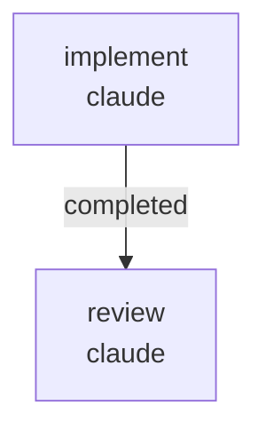

# RUNBOOK — 0033 web Generate-panel labels and tooltips

Source RFC: [`docs/rfcs/0060-web-generate-panel-form-labels-and-tooltips.md`](../../rfcs/0060-web-generate-panel-form-labels-and-tooltips.md)

Closes audit finding `AUD-O-003` from
`docs/audits/2026-05-22-code-doc-audit/operator-adoption/FINDINGS.md`.

## What this workflow does

Lands RFC 0060 in two sequential jobs:

1. `implement` (Claude, write lane) — creates
   `kayakgen/ui/parameter_metadata.py` with the `HullParameterMetadata`
   value object, the 11-row `HULL_PARAMETER_METADATA` registry, and the
   `label_with_unit` / `description` helpers. Wires the registry into the
   web form-builder so every base-hull rail field renders a friendly
   label with a `:hint` tooltip, the variable-selector picklist shows
   `label (unit)` titles, and the objectives picklist sources its titles
   from `OBJECTIVE_METADATA`. Adds a regression test under
   `tests/test_hull_parameter_metadata.py`, extends
   `tests/test_vocabulary_coverage.py` with `HullParameterMetadata`, and
   updates `docs/USER_GUIDE.md` + `docs/UBIQUITOUS_LANGUAGE.md`. The form
   submission payload stays byte-stable.

2. `review` (Claude, review lane) — verifies the implementer's changes
   against RFC 0060 acceptance criteria and writes a single REVIEW.md.



Artifacts land under
`docs/audits/2026-05-22-code-doc-audit/follow-ups/0033/`:

```
PATCH_SUMMARY.md
REVIEW.md
```

## Prerequisites

- `~/git/striatum/.venv/bin/striatum --version` >= 1.57.0.
- `claude` available on `PATH` (codex / gemini are configured as
  fallback lanes but the default plan uses claude end-to-end).
- `striatum doctor` reports `ok: true`.
- `.venv/bin/pytest` is available in the repo (Striatum-managed venv).
- RFC 0060 is landed at status `proposed`; this workflow promotes the
  source side only — the RFC status flip and CHANGELOG row are owned by
  the parent agent.

## Run

```bash
TARGET=/home/halbritt/git/kayak-gen
WF=$TARGET/docs/workflows/0033-web-generate-panel-labels/workflow.json

~/git/striatum/.venv/bin/striatum --repo "$TARGET" workflow validate "$WF" --json
~/git/striatum/.venv/bin/striatum --repo "$TARGET" workflow plan     "$WF" --json
~/git/striatum/.venv/bin/striatum --repo "$TARGET" run prepare       --workflow "$WF" --json
# copy the run_id from the response
~/git/striatum/.venv/bin/striatum --repo "$TARGET" run start --run-id <run_id> --json
~/git/striatum/.venv/bin/striatum --repo "$TARGET" dashboard --run-id <run_id> --once
```

## Verification commands

The `implement` job is expected to run, in a venv:

```bash
.venv/bin/pytest \
  tests/test_hull_parameter_metadata.py \
  tests/test_vocabulary_coverage.py \
  tests/test_generate_spec_form.py \
  tests/test_generate_frontier_view.py \
  -q
```

All tests must pass. `tests/test_generate_spec_form.py` is the
byte-stability gate — if it breaks, the wiring change altered the
submitted payload, which is a hard violation of RFC 0060 acceptance
criterion #2.

## After the run

1. Parent agent flips `AUD-O-003` from `open` to
   `closed (workflow 0033)` in
   `docs/audits/2026-05-22-code-doc-audit/operator-adoption/FINDINGS.md`.
2. Parent agent adds a `CHANGELOG.md ### Added` row pointing to
   AUD-O-003 and this workflow run.
3. Parent agent flips RFC 0060 from `proposed` to `landed` and updates
   `docs/rfcs/README.md`.

## Scope discipline

The implementer must not touch:

- `CHANGELOG.md`
- `docs/audits/2026-05-22-code-doc-audit/*/FINDINGS.md`
- `docs/rfcs/README.md`
- `docs/rfcs/0060-*.md`

These are the parent agent's job. The workflow's `forbidden_paths`
encodes this contract.
