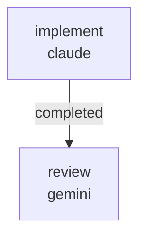

# RUNBOOK — 0034 desktop sliders on `HullParameterMetadata`

Source RFC: [`docs/rfcs/0061-desktop-sliders-on-hull-parameter-metadata.md`](../../rfcs/0061-desktop-sliders-on-hull-parameter-metadata.md)

Closes D043's named "desktop `SLIDERS` migration to the same registry"
follow-up (`docs/DECISION_LOG.md` D043 row).

## What this workflow does

Lands RFC 0061 in two sequential jobs:

1. `implement` (Claude, write lane) — extends
   `kayakgen/ui/parameter_metadata.py` with `VIEW_PARAMETER_METADATA`
   (one entry: `target_speed_kt`) and fall-back-through-both-registries
   helpers; creates `kayakgen/ui/desktop_slider_ranges.py` with
   `SLIDER_RANGES`, `SLIDER_STEPS`, `SLIDER_DEFAULTS` (numeric values
   byte-equal to today's desktop literals); rewrites
   `kayakgen/ui/desktop.py` so `KayakGUI.SLIDERS` / `DEFAULTS` /
   `GLOBAL_RANGES` derive from the registries and slider rows use
   canonical Hull field names (`length` → `length_m`, etc.); replaces
   the three `_hull_from_gui_params` call sites with a small
   `_hull_from_params` helper; updates `kayakgen/ui/pv_window.py` to
   drop the `_hull_from_gui_params` import; shrinks
   `kayakgen/ui/gui_params.py` to a `DeprecationWarning` shim with an
   empty `GUI_TO_HULL`; adds
   `tests/test_desktop_sliders_use_registry.py` covering the five RFC
   0061 §5 assertions; updates `tests/test_gui_params.py` to use
   canonical Hull keys and assert the deprecation warning.

2. `review` (Gemini, review lane) — verifies the implementer's changes
   against RFC 0061 acceptance criteria and writes a single
   `REVIEW.md`. Cross-provider (claude/gemini) lane diversity satisfies
   the `same_model_review_pair` validator.



Artifacts land under
`docs/audits/2026-05-22-code-doc-audit/follow-ups/0034/`:

```
PATCH_SUMMARY.md
REVIEW.md
```

## Prerequisites

- `~/git/striatum/.venv/bin/striatum --version` >= 1.57.0.
- `claude` and `gemini` available on `PATH`.
- `striatum doctor` reports `ok: true`.
- `.venv/bin/pytest` is available in the repo (Striatum-managed venv).
- RFC 0061 is landed at status `proposed`; this workflow promotes the
  source side only — the RFC status flip, the CHANGELOG row, the
  `docs/rfcs/README.md` row, and the D043 "Revisit" cell update are
  owned by the parent agent.

## Run

```bash
TARGET=/home/halbritt/git/kayak-gen
WF=$TARGET/docs/workflows/0034-desktop-sliders-on-registry/workflow.json

~/git/striatum/.venv/bin/striatum --repo "$TARGET" workflow validate "$WF" --json
~/git/striatum/.venv/bin/striatum --repo "$TARGET" workflow plan     "$WF" --json
~/git/striatum/.venv/bin/striatum --repo "$TARGET" run prepare       --workflow "$WF" --json
# copy the run_id from the response
~/git/striatum/.venv/bin/striatum --repo "$TARGET" run start --run-id <run_id> --json
~/git/striatum/.venv/bin/striatum --repo "$TARGET" dashboard --run-id <run_id> --once
```

## Verification commands

The `implement` job is expected to run, in a venv:

```bash
.venv/bin/pytest \
  tests/test_desktop_sliders_use_registry.py \
  tests/test_gui_params.py \
  tests/test_hull_parameter_metadata.py \
  tests/test_vocabulary_coverage.py \
  -q
```

If `tests/test_desktop_layout.py` is exercised in the implementer's
environment, run it too. The label source changed (registry-driven),
so the layout test's literal `expected_label` mapping must be updated
in lockstep — the implementer owns that fix.

## After the run

1. Parent agent flips RFC 0061 from `proposed` to `landed` and adds
   the row to `docs/rfcs/README.md`.
2. Parent agent updates the D043 "Revisit" cell in
   `docs/DECISION_LOG.md` to cite this RFC as the closed
   desktop-migration follow-up.
3. Parent agent adds a `CHANGELOG.md ### Changed` row pointing to RFC
   0061 and this workflow run.

## Scope discipline

The implementer must not touch:

- `CHANGELOG.md`
- `docs/audits/2026-05-22-code-doc-audit/*/FINDINGS.md`
- `docs/rfcs/README.md`
- `docs/rfcs/0061-*.md`
- `docs/DECISION_LOG.md`

These are the parent agent's job. The workflow's `forbidden_paths`
encodes this contract.
