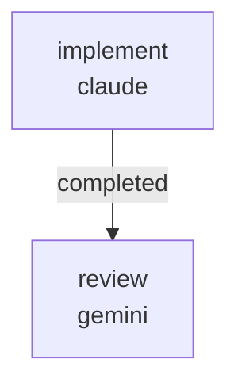

# RUNBOOK — 0035 render tests for RFC 0060 / 0061 label surfaces

Source audit: [`docs/audits/2026-05-23-code-doc-audit/REMEDIATION_PLAN.md`](../../audits/2026-05-23-code-doc-audit/REMEDIATION_PLAN.md)
batch R4.

Closes audit findings:

- **AUD-O-009** (medium) — RFC 0060 wires `HULL_PARAMETER_METADATA` into
  the web Generate panel form's base-hull rail via the Vuetify `:hint`
  prop, but no test verifies that the hint actually attaches to the
  rendered `VTextField` widgets. A future refactor could silently drop
  the wiring and the round-trip / payload tests would not notice.
- **AUD-O-010** (medium) — RFC 0061 wires `label_with_unit(key)` into
  `KayakGUI.SLIDERS` but no test inspects the constructed matplotlib
  `Slider(label=...)` argument to confirm the registry label makes it
  to the widget.

## What this workflow does

Lands two new render-verification tests in two sequential jobs (tests
only — no production source touched):

1. `implement` (Claude, write lane) — adds
   `tests/test_generate_panel_label_rendering.py` that monkeypatches
   `trame.widgets.vuetify3.VTextField.__init__` (and `VSelect.__init__`
   where applicable) around a `create_app(initial_hull=Hull())` call to
   capture the rendered widget constructor arguments, then asserts:

   (a) every base-hull rail `VTextField` has `hint=description(key)` and
       `label=label_with_unit(key)` for each key in `BASE_HULL_KEYS`;
   (b) the objectives picklist items list (state-seeded by
       `initialize_form_state`) has `title == f"{OBJECTIVE_METADATA[m].label} ({OBJECTIVE_METADATA[m].unit})"`
       for each metric;
   (c) the variable-selector picklist items have `title == label_with_unit(key)`
       for each `BASE_HULL_KEYS` entry.

   Also adds `tests/test_desktop_slider_labels.py` that constructs a
   `KayakGUI()` under `matplotlib.use("Agg")` and asserts each
   `KayakGUI.SLIDERS` row's matplotlib `Slider.label.get_text()` equals
   `label_with_unit(row[0])`, plus three named spot checks for `Cp`,
   `length_m`, and `target_speed_kt`.

2. `review` (Gemini, review lane) — verifies the new tests inspect the
   actual rendered widget arguments (not the form-state defaults or a
   source-string regex), would fail if the wiring were silently dropped,
   and that the implementer did not touch any of the read-only
   production modules. Cross-provider (claude / gemini) lane diversity
   satisfies the `same_model_review_pair` validator.



Artifacts land under
`docs/audits/2026-05-23-code-doc-audit/follow-ups/0035/`:

```
PATCH_SUMMARY.md
REVIEW.md
```

## Prerequisites

- `~/git/striatum/.venv/bin/striatum --version` >= 1.57.0.
- `claude` and `gemini` available on `PATH`.
- `striatum doctor` reports `ok: true`.
- `.venv/bin/pytest` available in the repo (Striatum-managed venv).
- The `kayakgen[web]` and `kayakgen[desktop]` extras must import cleanly
  in the implementer's venv; the new tests use `pytest.importorskip`
  for trame / vtk / matplotlib / PyQt6 so the suite still runs in
  partial-extras environments.

## Run

```bash
TARGET=/home/halbritt/git/kayak-gen
WF=$TARGET/docs/workflows/0035-render-tests-for-registry-labels/workflow.json

~/git/striatum/.venv/bin/striatum --repo "$TARGET" workflow validate "$WF" --json
~/git/striatum/.venv/bin/striatum --repo "$TARGET" workflow plan     "$WF" --json
~/git/striatum/.venv/bin/striatum --repo "$TARGET" run prepare       --workflow "$WF" --json
# copy the run_id from the response
~/git/striatum/.venv/bin/striatum --repo "$TARGET" run start --run-id <run_id> --json
~/git/striatum/.venv/bin/striatum --repo "$TARGET" dashboard --run-id <run_id> --once
```

## Verification commands

The `implement` job runs, in the project venv:

```bash
.venv/bin/pytest \
  tests/test_generate_panel_label_rendering.py \
  tests/test_desktop_slider_labels.py \
  tests/test_web_layout.py \
  tests/test_desktop_layout.py \
  tests/test_hull_parameter_metadata.py \
  tests/test_generate_spec_form.py \
  -q
```

All must pass.

## After the run

1. Parent agent flips AUD-O-009 and AUD-O-010 from `open` to `closed`
   in `docs/audits/2026-05-23-code-doc-audit/operator-adoption/FINDINGS.md`.
2. Parent agent adds a `CHANGELOG.md ### Added` row pointing at this
   workflow run and naming both finding IDs.

## Scope discipline

The implementer must NOT touch:

- `CHANGELOG.md`
- `docs/audits/2026-05-23-code-doc-audit/*/FINDINGS.md`
- `docs/rfcs/0060-*.md`, `docs/rfcs/0061-*.md`, `docs/rfcs/README.md`
- `docs/DECISION_LOG.md`
- `kayakgen/ui/parameter_metadata.py` (read-only)
- `kayakgen/ui/web/generate_spec_form.py` (read-only — the upstream
  WEB_UI_REWORK_2026-05-22 second-pass landing just rewired this file;
  the implementer reads its current state)
- `kayakgen/ui/desktop.py` (read-only)

These are encoded in the workflow's `forbidden_paths`. The new tests
must live in `tests/`; the patch summary lives in
`docs/audits/2026-05-23-code-doc-audit/follow-ups/0035/`.
