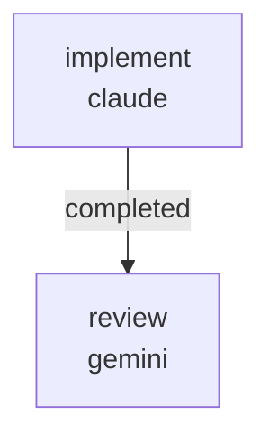

# RUNBOOK — 0036 CLI help-text polish

Source audit:
[`docs/audits/2026-05-23-code-doc-audit/REMEDIATION_PLAN.md`](../../audits/2026-05-23-code-doc-audit/REMEDIATION_PLAN.md)
batches R3 and R5.

Closes audit findings AUD-O-011 (R5, `runs list --kind` enumeration
asymmetry with `runs jobs`) and AUD-O-012 (R3, `hull_from_gui_params`
deprecation warning carries no on-disk RFC path).

## What this workflow does

Lands two low-severity help-text polish items in two sequential jobs:

1. `implement` (Claude, write lane) —
   - **AUD-O-011 (R5).** Edits
     `kayakgen/cli/runs_cli.py` `runs_list_command` so the `--kind`
     Typer option help enumerates `sweep | search | cfd | comparison`
     in the same style that `runs_jobs_command` already enumerates its
     `--state` and `--kind` options.
   - **AUD-O-012 (R3).** Edits
     `kayakgen/ui/gui_params.py` `hull_from_gui_params` so the
     `DeprecationWarning` text appends the on-disk RFC path
     `docs/rfcs/0061-desktop-sliders-on-hull-parameter-metadata.md`
     so an operator hitting the warning can `grep` for it or open the
     file directly.
   - Updates `tests/test_gui_params.py`'s
     `test_hull_from_gui_params_emits_rfc_0061_deprecation_warning`
     match string to also assert the on-disk path is mentioned (the
     existing `"RFC 0061"` substring continues to match because that
     phrase stays in the warning text).

2. `review` (Gemini, review lane) — verifies the implementer's changes
   close AUD-O-011 / AUD-O-012 and writes a single `REVIEW.md`.
   Cross-provider (claude / gemini) lane diversity satisfies the
   `same_model_review_pair` validator.



Artifacts land under
`docs/audits/2026-05-23-code-doc-audit/follow-ups/0036/`:

```
PATCH_SUMMARY.md
REVIEW.md
```

## Prerequisites

- `~/git/striatum/.venv/bin/striatum --version` >= 1.57.0.
- `claude` and `gemini` available on `PATH`.
- `striatum doctor` reports `ok: true`.
- `.venv/bin/pytest` is available in the repo (Striatum-managed venv).
- The 2026-05-23 release_candidate audit is on disk; this workflow
  flips only the source-side help text. The parent agent owns the
  audit `FINDINGS.md` status flips and the `CHANGELOG.md` row.

## Run

```bash
TARGET=/home/halbritt/git/kayak-gen
WF=$TARGET/docs/workflows/0036-cli-help-text-polish/workflow.json

~/git/striatum/.venv/bin/striatum --repo "$TARGET" workflow validate "$WF" --json
~/git/striatum/.venv/bin/striatum --repo "$TARGET" workflow plan     "$WF" --json
~/git/striatum/.venv/bin/striatum --repo "$TARGET" run prepare       --workflow "$WF" --json
# copy the run_id from the response
~/git/striatum/.venv/bin/striatum --repo "$TARGET" run start --run-id <run_id> --json
~/git/striatum/.venv/bin/striatum --repo "$TARGET" dashboard --run-id <run_id> --once
```

## Verification commands

The `implement` job is expected to run, in a venv:

```bash
.venv/bin/pytest \
  tests/test_gui_params.py \
  tests/test_desktop_sliders_use_registry.py \
  tests/test_cfd_jobs.py \
  tests/test_cfd_jobs_openfoam.py \
  -q
```

If `tests/test_runs_cli.py` exists at the time of the run (none today),
add it. All tests must pass.

## After the run

1. Parent agent flips AUD-O-011 status from `partial-closed` to
   `closed` and AUD-O-012 from `open` to `closed` in
   `docs/audits/2026-05-23-code-doc-audit/operator-adoption/FINDINGS.md`.
2. Parent agent adds a `CHANGELOG.md ### Changed` row pointing to the
   two audit IDs and this workflow run.

## Scope discipline

The implementer must not touch:

- `CHANGELOG.md`
- `docs/audits/2026-05-23-code-doc-audit/*/FINDINGS.md`
- `docs/audits/2026-05-23-code-doc-audit/REMEDIATION_PLAN.md`
- `docs/rfcs/`
- `docs/DECISION_LOG.md`
- `kayakgen/ui/web/` (workflow 0035 owns the web side)
- `kayakgen/ui/desktop.py` (workflow 0035 owns the desktop slider test)

These are the parent agent's job or owned by other workflows. The
workflow's `forbidden_paths` encodes this contract.
