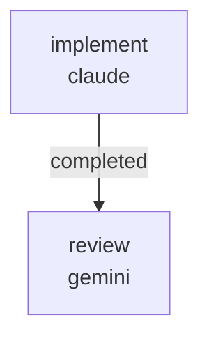

# RUNBOOK — 0037 web UI inline-help additions

Source audit: [`docs/audits/2026-05-25-code-doc-audit/REMEDIATION_PLAN.md`](../../audits/2026-05-25-code-doc-audit/REMEDIATION_PLAN.md)
batch R2.

Closes audit findings:

- **AUD-O-001** (medium) — validity badge state meaning not self-evident.
  The chip carries `data-testid="validity-badge"` and a dynamic
  `aria-label`, but sighted users without screen readers see only the
  badge text (`In Elite surfski envelope` / `Custom — sub-touring` /
  etc.) and a soft success / warn colour. No tooltip or popover names
  what each envelope is or why "custom" matters.
- **AUD-O-002** (medium) — comparison-source toggle's "Imported report"
  button is ambiguous. The operator does not know what an imported
  report is or where to get one without scrolling into the JSON
  textarea that the toggle reveals.
- **AUD-O-003** (low) — the mesh readiness chip pair softens the
  pre-rework "unavailable" contradiction by showing a `No package
  built` chip alongside the live `status_readiness` chip, but a
  first-time operator may still see both labels and not understand
  the relationship between them.
- **AUD-O-004** (medium) — the kind-aware Submit button has no
  `disabled` attribute and no inline reason copy. When the form is
  unsubmittable (no variables, no admissible objective), the operator
  sees a clickable button that yields a backend error instead of an
  inline "Requires at least one variable" / "Objectives not admissible"
  hint at the point of decision.
- **AUD-O-006** (low) — `mesh_diagnostics_rows_from_state` returns rows
  with raw dict-key labels (`boundary_edges`, `nonmanifold_edges`,
  `bad_edges`, `open_faces`, `thin_triangles`) that do not explain
  what the operator should do about each value.
- **AUD-O-007** (info / partial) — the high-angle GZ tonal alert in
  the Hydro tab still cites RFC 0020 / RFC 0024 in operator-facing copy.
  R1 documented the alert in USER_GUIDE; this workflow rewrites the
  in-app copy itself to drop the RFC citations.

## What this workflow does

Lands inline-help additions in two sequential jobs:

1. `implement` (Claude, write lane) — edits
   `kayakgen/ui/web/app.py`, `kayakgen/ui/web/generate_spec_form.py`,
   and `kayakgen/services/evaluation.py` per the audit's R2 batch
   recommendations. Adds render-verification tests under a new
   `tests/test_web_inline_help.py` that mirror the introspection
   pattern from `tests/test_web_layout.py`. The wire payload of
   `build_spec_from_form_state` must remain byte-stable across the
   changes; the existing layout-test invariants (data-testid hooks,
   tab structure, chip pair when no package) must continue to pass.

2. `review` (Gemini, review lane) — verifies each finding's acceptance
   criterion has actual code+test coverage, not just template-string
   additions; confirms wire-payload stability; confirms scope
   discipline.



Artifacts land under
`docs/audits/2026-05-25-code-doc-audit/follow-ups/0037/`:

```
PATCH_SUMMARY.md
REVIEW.md
```

## Prerequisites

- `striatum --version` >= 2.7.0.
- `claude` and `gemini` available on `PATH`.
- `striatum doctor` reports `ok: true`.
- `.venv/bin/pytest` available in the repo (Striatum-managed venv).
- The `kayakgen[web]` extra must import cleanly in the implementer's
  venv; the new tests use `pytest.importorskip` for trame / vtk so
  the suite still runs in partial-extras environments.

## Run

```bash
TARGET=/home/halbritt/git/kayak-gen
WF=$TARGET/docs/workflows/0037-web-ui-inline-help/workflow.json

striatum --repo "$TARGET" workflow validate "$WF" --json
striatum --repo "$TARGET" workflow plan     "$WF" --json
striatum --repo "$TARGET" run prepare       --workflow "$WF" --json
striatum --repo "$TARGET" run start --run-id <run_id> --json
striatum --repo "$TARGET" dashboard --run-id <run_id> --once
```

## Verification commands

The `implement` job runs, in the project venv:

```bash
.venv/bin/pytest \
  tests/test_web_inline_help.py \
  tests/test_web_layout.py \
  tests/test_web.py \
  tests/test_ui_theme.py \
  tests/test_vocabulary_coverage.py \
  -q
```

All must pass.

## After the run

1. Parent agent flips AUD-O-001..006 statuses in
   `docs/audits/2026-05-25-code-doc-audit/SYNTHESIS.md` from
   `open — deferred to R2` to `closed by 0037`.
2. Parent agent adds a `CHANGELOG.md ### Added` row pointing at this
   workflow run and naming the closed finding IDs.

## Scope discipline

The implementer must NOT touch:

- `CHANGELOG.md` (parent agent)
- `docs/USER_GUIDE.md` (R1 already updated)
- `docs/DECISION_LOG.md`
- `docs/audits/README.md`, `docs/audits/2026-05-25-code-doc-audit/SYNTHESIS.md`,
  `REMEDIATION_PLAN.md`, or any `FINDINGS.md`
- `docs/rfcs/` (R3 territory for hydro-row registry; this workflow is
  copy + wiring only, no new RFC)
- `kayakgen/ui/web/generate_frontier_view.py` (untouched by R2)
- `kayakgen/ui/web/controllers.py` (export-only glue, no behavior
  change needed)
- `kayakgen/ui/parameter_metadata.py` (read-only — the registry the
  rework already consumes)

These are encoded in the workflow's `forbidden_paths`. Hydro-row
label changes belong in workflow 0038 (R3); this workflow handles
mesh-diagnostic labels and validity / comparison / submit / GZ-alert
copy only.
