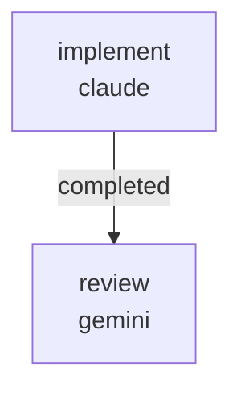

# RUNBOOK — 0038 hydrostatics row metadata registry

Source audit: [`docs/audits/2026-05-25-code-doc-audit/REMEDIATION_PLAN.md`](../../audits/2026-05-25-code-doc-audit/REMEDIATION_PLAN.md)
batch R3.

Closes audit findings:

- **AUD-O-005** (low) — the Hydro tab's `analysis_view_model`
  hardcodes hydro row labels at `kayakgen/services/evaluation.py:113-121`
  as in-line tuples (`"Displacement"`, `"Wetted surface"`,
  `"Waterplane area"`, `"GM0"`, `"Cp actual"`, `"Cm actual"`,
  `"L/B wl"`). Each label is reasonable, but they are not
  centralized in a registry the way the RFC 0060
  `HullParameterMetadata` / RFC 0061 desktop-slider labels are. If a
  label needs to change (e.g. `"GM0"` → `"Metacentric height (m)"`)
  the change must be made in two places (the inline tuple and any
  consumer that pins the string), and there is no single
  documentation surface explaining what each row represents.

## What this workflow does

Lands the registry + RFC in two sequential jobs:

1. `implement` (Claude, write lane):
   - Adds `kayakgen/ui/hydrostatics_metadata.py` with a
     `HydrostaticsRowMetadata` value object (label, unit,
     description) and a frozen `HYDROSTATICS_ROW_METADATA` registry
     keyed by hydro-row id (`displacement`, `wetted_surface`,
     `waterplane_area`, `gm0`, `cp_actual`, `cm_actual`,
     `l_over_bwl`).
   - Updates `kayakgen/services/evaluation.py::analysis_view_model`
     to source `label` and `unit` from the new registry instead of
     hardcoded tuples. The `value` slot keeps its existing
     formatting; only `label` and `unit` become registry-sourced.
     `hydro_rows_from_state` continues to call `analysis_view_model`
     and renders the same `{label, value}` dicts.
   - Adds `tests/test_hydrostatics_row_metadata.py` mirroring the
     regression-net shape of `tests/test_hull_parameter_metadata.py`:
     coverage check that every key referenced by
     `analysis_view_model` has a registry entry; round-trip check
     that `hydro_rows_from_state(state)` output is byte-stable
     across the refactor (compare against a frozen snapshot).
   - Lands `docs/rfcs/0062-hydrostatics-row-metadata-registry.md`
     documenting the pattern, referencing RFC 0060 / RFC 0061 / D043.
   - Updates `docs/rfcs/README.md` with the 0062 row.

2. `review` (Gemini, review lane) — verifies the registry covers
   every row, the wire payload is byte-stable, the RFC is internally
   consistent, and the scope discipline is honored.



Artifacts land under
`docs/audits/2026-05-25-code-doc-audit/follow-ups/0038/`:

```
PATCH_SUMMARY.md
REVIEW.md
```

## Prerequisites

- `striatum --version` >= 2.7.0.
- `claude` and `gemini` available on `PATH`.
- `striatum doctor` reports `ok: true`.
- `.venv/bin/pytest` available in the repo.

## Run

```bash
TARGET=/home/halbritt/git/kayak-gen
WF=$TARGET/docs/workflows/0038-hydrostatics-row-metadata-registry/workflow.json

striatum --repo "$TARGET" workflow validate "$WF" --json
striatum --repo "$TARGET" workflow plan     "$WF" --json
striatum --repo "$TARGET" run prepare       --workflow "$WF" --json
striatum --repo "$TARGET" run start --run-id <run_id> --json
striatum --repo "$TARGET" dashboard --run-id <run_id> --once
```

## Verification commands

The `implement` job runs, in the project venv:

```bash
.venv/bin/pytest \
  tests/test_hydrostatics_row_metadata.py \
  tests/test_hull_parameter_metadata.py \
  tests/test_web_layout.py \
  tests/test_vocabulary_coverage.py \
  -q
```

All must pass.

## After the run

1. Parent agent flips AUD-O-005 in
   `docs/audits/2026-05-25-code-doc-audit/SYNTHESIS.md` from
   `open — deferred to R3` to `closed by 0038`.
2. Parent agent adds a `CHANGELOG.md` row pointing at this workflow
   run, the new RFC 0062, and AUD-O-005.
3. Parent agent decides whether a new `DECISION_LOG.md` row is
   warranted (likely yes — a "D044: Hydrostatics row metadata is a
   sibling registry to HullParameterMetadata" row mirroring D043).

## Scope discipline

The implementer must NOT touch:

- `CHANGELOG.md` (parent agent)
- `docs/USER_GUIDE.md` (R1 already updated)
- `docs/DECISION_LOG.md` (parent agent)
- `docs/audits/2026-05-25-code-doc-audit/SYNTHESIS.md`,
  `REMEDIATION_PLAN.md`, any `FINDINGS.md`,
  `docs/audits/README.md`
- `docs/SPEC.md`, `docs/PRD.md`, `docs/ROADMAP.md`,
  `docs/ARCHITECTURE_MAP.md`, `docs/UBIQUITOUS_LANGUAGE.md`
  (parent agent updates these only if needed)
- `kayakgen/ui/web/` (R2 territory; this workflow is service-layer
  and RFC only)
- `kayakgen/ui/parameter_metadata.py` (the sibling registry; read-
  only here)
- `kayakgen/ui/desktop.py`, `kayakgen/ui/desktop_slider_ranges.py`,
  `kayakgen/ui/gui_params.py` (desktop is unaffected)

These are encoded in the workflow's `forbidden_paths`.

## Coordination with workflow 0037 (R2)

Both workflows touch `kayakgen/services/evaluation.py`. The
`require_disjoint_write_scopes` parallelism setting means they
cannot run concurrently; **0037 must land first**. The function
splits:

- **0037 (R2) owns**: `mesh_diagnostics_rows_from_state` (label
  edits for AUD-O-006).
- **0038 (R3) owns**: `analysis_view_model::hydro_rows` (registry
  consumption for AUD-O-005). `hydro_rows_from_state` is read-only
  in both workflows; it remains the pass-through helper introduced
  by `b82b544`.

If 0037 is in flight when 0038 starts, 0038's `implement` agent
must rebase against the post-0037 tree before editing
`evaluation.py`.
