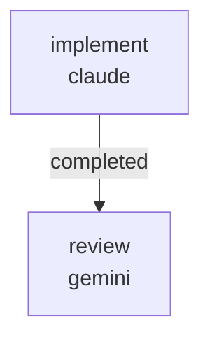

# RUNBOOK — 0039 Hydro tab description rendering

Source audit: [`docs/audits/2026-05-25-full-repo-code-doc-audit/REMEDIATION_PLAN.md`](../../audits/2026-05-25-full-repo-code-doc-audit/REMEDIATION_PLAN.md)
batch R2.

Closes audit findings:

- **AUD-O-003** (medium) — `kayakgen/ui/hydrostatics_metadata.py`
  ships seven `description` fields under the
  `HYDROSTATICS_ROW_METADATA` registry, but the web Hydro tab
  renders only label + value. The descriptions are operator-facing
  copy written for discovery, with no UI surface to reveal them.
  R1 of the 2026-05-25 full_repo audit landed a USER_GUIDE note
  pointing operators at the registry source; this workflow lands
  the actual tooltip rendering so the descriptions become a
  hover-affordance in the workspace.

## What this workflow does

Lands the tooltip rendering in two sequential jobs:

1. `implement` (Claude, write lane):
   - Widens `hydro_rows_from_state` in
     `kayakgen/services/evaluation.py` to include a `"description"`
     key in each emitted dict, sourced from
     `HYDROSTATICS_ROW_METADATA[key].description`. Warning rows
     (appended for design advisories) carry an empty string.
   - Wraps the Hydro-tab table row in `kayakgen/ui/web/app.py`
     with a Vuetify `v-tooltip` slot bound to `{{ row.description }}`,
     suppressed when the description is empty (so Warning rows do
     not show a misleading empty tooltip).
   - Updates `tests/test_hydrostatics_row_metadata.py` to extend
     the byte-stable regression assertion to include the new
     `description` key — intentional widening, not relaxation.
   - Adds `tests/test_hydro_tab_descriptions.py` with render-
     verification tests asserting each registered description
     appears in the rendered HTML for the corresponding row.

2. `review` (Gemini, review lane) — verifies the widening is
   correctly sourced from the registry, the tooltip is suppressed
   for empty descriptions, the test widening is intentional (not
   a relaxation of the existing pinning), and scope discipline
   is honored.



Artifacts land under
`docs/audits/2026-05-25-full-repo-code-doc-audit/follow-ups/0039/`:

```
PATCH_SUMMARY.md
REVIEW.md
```

## Prerequisites

- `~/git/striatum/.venv/bin/striatum --version` >= 1.57.0.
- `claude` and `gemini` available on `PATH`.
- `striatum doctor` reports `ok: true`.
- `.venv/bin/pytest` available in the repo.

## Run

```bash
TARGET=/home/halbritt/git/kayak-gen
WF=$TARGET/docs/workflows/0039-hydro-tab-description-rendering/workflow.json

~/git/striatum/.venv/bin/striatum --repo "$TARGET" workflow validate "$WF" --json
~/git/striatum/.venv/bin/striatum --repo "$TARGET" workflow plan     "$WF" --json
~/git/striatum/.venv/bin/striatum --repo "$TARGET" run prepare       --workflow "$WF" --json
~/git/striatum/.venv/bin/striatum --repo "$TARGET" run start --run-id <run_id> --json
```

## Verification commands

The `implement` job runs, in the project venv:

```bash
.venv/bin/pytest \
  tests/test_hydro_tab_descriptions.py \
  tests/test_hydrostatics_row_metadata.py \
  tests/test_web_inline_help.py \
  tests/test_web_layout.py \
  tests/test_web.py \
  -q
```

All must pass.

## After the run

1. Parent agent flips AUD-O-003 in
   `docs/audits/2026-05-25-full-repo-code-doc-audit/SYNTHESIS.md`
   from `open` to `closed by 0039`.
2. Parent agent adds a `CHANGELOG.md ### Changed` row pointing at
   this workflow run and AUD-O-003.

## Scope discipline

The implementer must NOT touch:

- `CHANGELOG.md` (parent agent)
- `docs/USER_GUIDE.md` (R1 of the audit already added the gap
  note; once R2 lands, the next audit cycle decides whether to
  remove the gap note or update it)
- `docs/DECISION_LOG.md`, `docs/SPEC.md`, `docs/PRD.md`,
  `docs/ROADMAP.md`, `docs/ARCHITECTURE_MAP.md`,
  `docs/UBIQUITOUS_LANGUAGE.md`, `docs/WEB_VERIFICATION.md`,
  `docs/audits/README.md`, audit SYNTHESIS / REMEDIATION_PLAN /
  FINDINGS files
- `docs/rfcs/` — no new RFC; RFC 0062 already covers the
  registry contract
- `kayakgen/ui/hydrostatics_metadata.py` — read-only registry
- `kayakgen/ui/parameter_metadata.py`,
  `kayakgen/ui/web/generate_spec_form.py`,
  `kayakgen/ui/web/generate_frontier_view.py`,
  `kayakgen/ui/web/controllers.py`,
  `kayakgen/ui/desktop.py`,
  `kayakgen/ui/desktop_slider_ranges.py`,
  `kayakgen/ui/gui_params.py`

These are encoded in the workflow's `forbidden_paths`.
