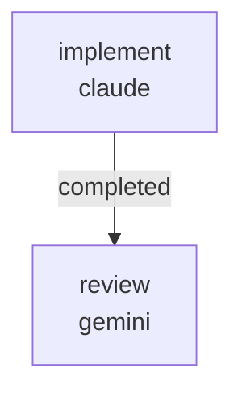

# RUNBOOK — 0040 nested-key search variables (RFC 0063)

Source RFC: [`docs/rfcs/0063-nested-key-search-variables.md`](../../rfcs/0063-nested-key-search-variables.md)

## What this workflow does

Lands the dotted-path search-variable mechanism proposed by RFC 0063
in two sequential jobs:

1. `implement` (Claude, write lane):
   - Edits `kayakgen/search/active/runner.py::_hull_from_genome` so
     genome keys may contain dots; flat keys retain today's
     behaviour. Implementation per the resolver sketch in RFC 0063
     §"Proposal" step 2.
   - Edits `kayakgen/search/active/spec.py` to add a
     `SearchSpec` `model_validator` that walks each dotted-path key
     against a synthesized `Hull.model_validate(base_hull)` and
     rejects missing-leaf paths at spec-load time.
   - Adds `tests/test_active_search_nested_keys.py` with the three
     tests named in RFC 0063 §"Acceptance Criteria" plus a smoke
     test that a search-space variable
     `distribution_v2.cross_section_family` as a `ChoiceVariable`
     produces candidates with different families.
   - Adds `docs/examples/search_distribution_v2_section_family.json`
     mirroring the spec body shown in RFC 0063 §"Acceptance
     Criteria".
   - Flips RFC 0063 status from `proposed` to `landed` and updates
     `docs/rfcs/README.md` to mark the same in the status column.

2. `review` (Gemini, review lane) — verifies flat-key byte-stability,
   dotted-path correctness, validator coverage at spec-load time,
   and that the new example actually runs.



Artifacts land under
`docs/workflows/0040-rfc-0063-nested-key-search-variables/`:

```
PATCH_SUMMARY.md
REVIEW.md
```

## Prerequisites

- `striatum --version` >= 2.7.0.
- `claude` and `gemini` available on `PATH`.
- `striatum doctor` reports `ok: true`.
- `.venv/bin/pytest` available in the repo.

## Run

```bash
TARGET=/home/halbritt/git/kayak-gen
WF=$TARGET/docs/workflows/0040-rfc-0063-nested-key-search-variables/workflow.json

striatum --repo "$TARGET" workflow validate "$WF" --json
striatum --repo "$TARGET" workflow plan     "$WF" --json
striatum --repo "$TARGET" run prepare       --workflow "$WF" --json
striatum --repo "$TARGET" run start --run-id <run_id> --json
striatum --repo "$TARGET" dashboard --run-id <run_id> --once
```

## Verification commands

The `implement` job runs, in the project venv:

```bash
.venv/bin/pytest \
  tests/test_active_search_nested_keys.py \
  tests/test_active_search.py \
  tests/test_search_spec.py \
  -q
```

All must pass. Existing search tests must continue to pass without
modification (proves the flat-key byte-stability contract).

The reviewer additionally runs the new example end-to-end with a
3-evaluation budget:

```bash
.venv/bin/kayakgen search \
  docs/examples/search_distribution_v2_section_family.json \
  --out /tmp/rfc63_smoke_out
```

and asserts the run completes with at least one candidate of each
declared `cross_section_family` value present in the run records.

## After the run

1. Parent agent decides whether a `CHANGELOG.md` row is warranted
   (RFC + behaviour change → yes).
2. No `DECISION_LOG.md` row needed — RFC 0063 already documents the
   "dotted-path keys as genome→hull adapter" decision in §"Domain
   Modeling".

## Scope discipline

The implementer must NOT touch:

- `CHANGELOG.md`, `docs/USER_GUIDE.md`, `docs/DECISION_LOG.md`,
  `docs/SPEC.md`, `docs/PRD.md`, `docs/ROADMAP.md`,
  `docs/ARCHITECTURE_MAP.md`, `docs/UBIQUITOUS_LANGUAGE.md`
  (parent agent territory).
- `kayakgen/model/hull.py`, `kayakgen/model/distribution_v2.py` —
  the geometry aggregate is read-only here; the change is purely in
  the search→hull adapter.
- `kayakgen/search/sweep.py`, `kayakgen/search/objectives.py`,
  `kayakgen/search/pareto.py` — sweep / objective registry /
  Pareto code are not in scope (RFC 0063 §"Non-Goals" excludes the
  sweep expander).

The reviewer writes only `REVIEW.md` under this workflow directory
and must not modify implementation files.
