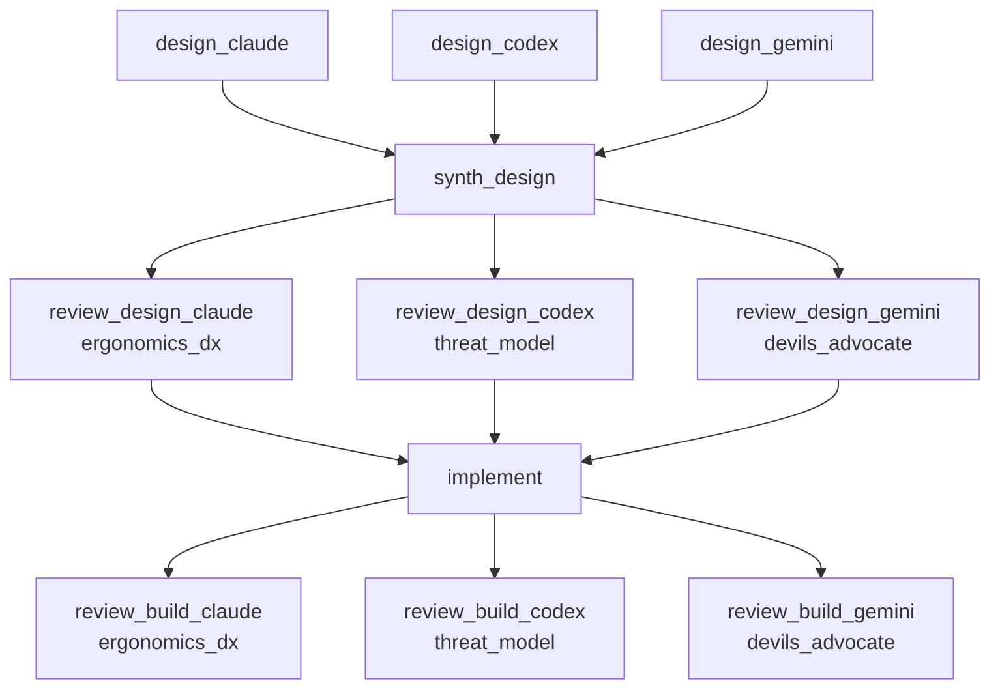

# RUNBOOK — 0043 RFC 0043 stage 4 + RFC 0056 stage-4 promotion pipeline

Source RFCs:
- [`docs/rfcs/0043-high-angle-gz-successor.md`](../../rfcs/0043-high-angle-gz-successor.md)
- [`docs/rfcs/0056-strain-gauged-gz-rig.md`](../../rfcs/0056-strain-gauged-gz-rig.md)

## What this workflow does

Builds the promotion pipeline that takes a `measured_stability_fixture`
(RFC 0056 schema, currently landed schemas-only) through acceptance
into the claim-state resolution path that RFC 0043 stage 4 needs to
flip analytical-only high-angle GZ output to measured-or-better.

The workflow shape is **panel design + 3-lane review + implement +
3-lane build review**:

1. **Panel design** (3 parallel jobs) — claude / codex / gemini each
   write an independent design proposal to their own `artifacts/design/<lane>/DESIGN.md`.
2. **Synthesize** (1 job) — claude (coordinator) reads the three
   designs, identifies shared structure and disagreements, and
   writes `artifacts/synthesis/DESIGN_SYNTHESIS.md` declaring the
   accepted design plus an Open Questions block where the panel
   diverged.
3. **3-lane design review** (3 parallel jobs) — claude (ergonomics_dx),
   codex (threat_model), gemini (devils_advocate) each review the
   synthesized design under their respective posture and write
   `artifacts/review/design/<lane>/REVIEW.md`. A `needs_revision`
   verdict from any lane bounces back to the synthesizer (max 2
   revision cycles per lane).
4. **Implement** (1 job, claude) — lands the pipeline code per the
   accepted design: ingestion CLI under `kayakgen calibration`,
   acceptance logic in `kayakgen/eval/stability/measured_acceptance.py`,
   claim-state resolution path in `kayakgen/eval/claims.py`,
   tests under `tests/test_measured_stability_*.py`,
   `docs/USER_GUIDE.md` + `docs/DECISION_LOG.md` updates. Writes
   `artifacts/build/HANDOFF.md`.
5. **3-lane build review** (3 parallel jobs) — same posture
   distribution against the implementation. `needs_revision` bounces
   back to the implementer (max 2 revisions per lane).



Artifacts land under
`docs/workflows/0043-rfc-0043-stage-4-stability-rig-pipeline/artifacts/`:

```
artifacts/
  design/claude/DESIGN.md
  design/codex/DESIGN.md
  design/gemini/DESIGN.md
  synthesis/DESIGN_SYNTHESIS.md
  review/design/claude/REVIEW.md
  review/design/codex/REVIEW.md
  review/design/gemini/REVIEW.md
  build/HANDOFF.md
  review/build/claude/REVIEW.md
  review/build/codex/REVIEW.md
  review/build/gemini/REVIEW.md
```

## Scope — what this workflow does NOT cover

- **No physical rig hardware acquisition.** This workflow lands the
  pipeline that consumes RFC 0056 schema; the rig itself + the
  measured-data acquisition campaign remain a separate operator
  action tracked by D007 / D014 in `docs/DECISION_LOG.md`.
- **No flip of RFC 0043 / RFC 0056 Status.** The implement job stays
  out of `docs/rfcs/`. Once an accepted fixture exists and the
  pipeline has consumed it end-to-end at least once, a follow-up
  doc-only commit flips both RFCs to `landed` (the implementer's
  forbidden_paths list enforces this).
- **No CFD-in-loop integration.** RFC 0046 owns that path; the
  measured-stability pipeline runs independently.

## Prerequisites

- `striatum --version` >= 2.8.0.
- `claude`, `codex`, and `gemini` available on `PATH`.
- `striatum doctor` reports `ok: true`.
- `.venv/bin/pytest` available in the repo.
- For each lane, the per-lane `supervision: {transport: pty_helper,
  require_tmux: true}` config in `workflow.json` selects the
  tmux-backed supervisor — this is the only backend that survives
  nested lane spawning (RFC 0075 / D131).

## Run

```bash
TARGET=/home/halbritt/git/kayak-gen
WF=$TARGET/docs/workflows/0043-rfc-0043-stage-4-stability-rig-pipeline/workflow.json

striatum --repo "$TARGET" workflow validate "$WF" --json
RUN=$(striatum --repo "$TARGET" run prepare --workflow "$WF" --json | jq -r .run_id)
striatum --repo "$TARGET" branch confirm --run_id "$RUN" \
  --branch striatum/0043-rfc-0043-stage-4-stability-rig-pipeline --json
striatum --repo "$TARGET" run start --run_id "$RUN" --json

for ROLE_LANE in "designer:claude" "designer:codex" "designer:gemini" \
                 "synthesizer:claude" \
                 "reviewer:claude" "reviewer:codex" "reviewer:gemini" \
                 "implementer:claude"; do
  ROLE=${ROLE_LANE%:*}; LANE=${ROLE_LANE#*:}
  SESS=$(striatum --repo "$TARGET" register-session \
           --run_id "$RUN" --role "$ROLE" --lane "$LANE" --fresh --json \
           | jq -r .session_id)
  nohup striatum --repo "$TARGET" supervise start --session_id "$SESS" \
    >/tmp/sup_${ROLE}_${LANE}.log 2>&1 &
done
disown

striatum --repo "$TARGET" dashboard --run_id "$RUN" --once
```

The supervisors run as detached `striatumd -agent-loop` processes
inside named tmux sessions (visible via `tmux ls`). They survive
the parent shell exit.

## Verification commands

After the `implement` job lands but before the build review fires,
sanity-check the implementation in the project venv:

```bash
.venv/bin/pytest \
  tests/test_measured_stability_acceptance.py \
  tests/test_measured_stability_ingest.py \
  tests/test_claim_state_measured_promotion.py \
  -q
```

The implementer's `HANDOFF.md` should attach the test summary
(pass/fail/skip counts).

## After the run

Once all three build-review verdicts converge on `accept`:

1. Parent agent records the workflow run in `CHANGELOG.md`.
2. Parent agent flips RFC 0043 and RFC 0056 `Status:` lines to
   `landed` in their respective `docs/rfcs/00XX-*.md` files and in
   `docs/rfcs/README.md` index rows (this is the doc-only commit the
   implementer was forbidden from making).
3. Parent agent decides whether D007 / D014 should be marked
   "tooling landed; awaiting rig data" in `docs/DECISION_LOG.md`.

## Scope discipline

The implementer must NOT touch:

- `docs/rfcs/` (RFC status flips are parent-agent territory after
  build review converges)
- `kayakgen/ui/`, `kayakgen/services/` (presentation + service
  layers; this pipeline is data-layer)
- `kayakgen/model/hull.py`, `kayakgen/model/distribution_v2.py`
  (geometry aggregate)
- `kayakgen/search/`, `kayakgen/eval/resistance.py`, `kayakgen/eval/cfd/`
  (unrelated subdomains)
- `CHANGELOG.md` (parent agent records the workflow run after the
  full job graph completes)

Reviewers write only to their own `artifacts/review/.../REVIEW.md`
and must not modify implementation files.
